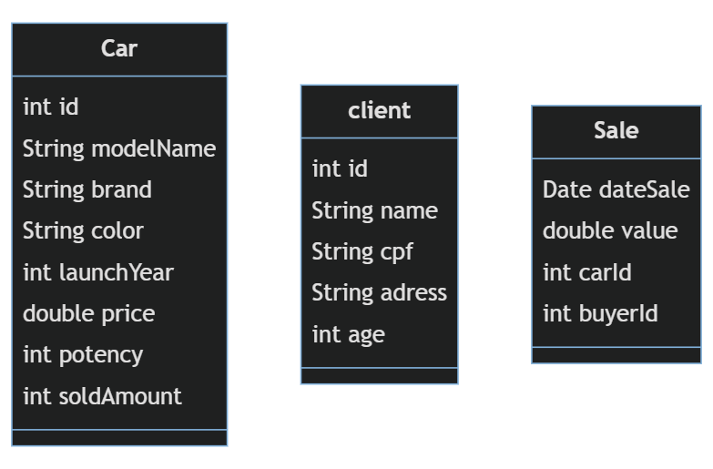
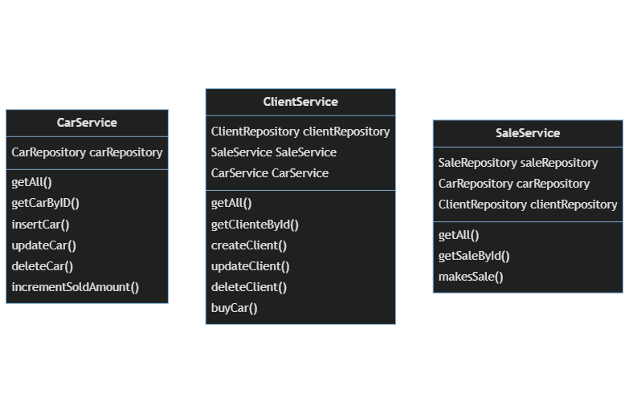
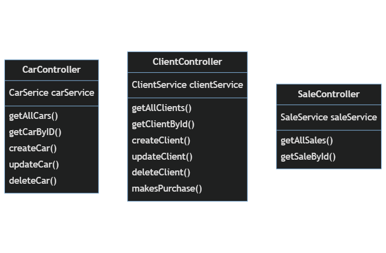

<h1>Api - Concessionária de veículos</h1>

Esse projeto é uma API de uma concessionária, no sistema há carros a serem vendidos, clientes que poderão comprar os carros, e vendas que armazenam as informações desta.

<h2>Descrição</h2>

    Esse sistema é uma concessionária de carros que podem ser
    vendidos, há opção de CRUD com os carros no sistema e opção
    de compra por parte do cliente.
    O cliente é outra entidade do sistema onde também pode ser
    realizado operações de CRUD, o cliente pode comprar carros
    que estão na concessionária, há uma relação de muitos para
    muitos entre as entidades de carros e clientes, e a ligação é
    justamente através da entidade venda, que armazena as
    informações da venda realizada.

<h2>Design e Arquitetura</h2>

    O projeto foi desenvolvido no padrão MVC com um pacote de
    entidades, um de serviços e outro de controladores, além de um
    pacote auxiliar de repositórios.

    No pacote service, há interfaces e classes com suas
    respectivas implementações, para realizar as regras de 
    negócio da aplicação

    

<h3>
    
Abaixo segue as entidades do Sistema:

</h3>

 

No sistema há também classes de DTO para inserção das informações.

<h3>Serviços</h3>

    O software também conta com classes de serviço que são responsáveis pela regra de negócio,
    segue a seguir as classes de serviço:

<h3>Repositórios</h3>

Também há classes de comunicação com os repositórios, com o padrão do nome da classe seguida da palavra repository, segue a lista:

<ul>
    <li>CarRepository</li>
    <li>ClientRepository</li>
    <li>SaleRepository</li>
</ul>

O projeto foi pensado com conexão ao banco de dados PostgreSQL, onde será armazenado os dados da aplicação.

<h3>Controller</h3>

    O sistema possui uma camada de controller responsável pela recepção dos dados,
    contendo métodos http como <b>get</b>, <b>post</b>, <b>put</b> e <b>delete</b>

<h2>Tecnologias Utilizadas:</h2>

<ul>
    <li>Java</li>
    <li>Spring Boot</li>
    <li>Spring JPA</li>
    <li>Hibernate</li>
    <li>Maven</li>
    <li>PostgreSQL</li>
    <li>JUnit</li>
    <li>Mockito</li>
</ul>

<h2>Pré-requisitos</h2>
<ul>
    <li>Java 11</li>
    <li>Maven</li>
    <li>PostgreSQL (recomendado)</li>
    <li>Git</li>
</ul>
